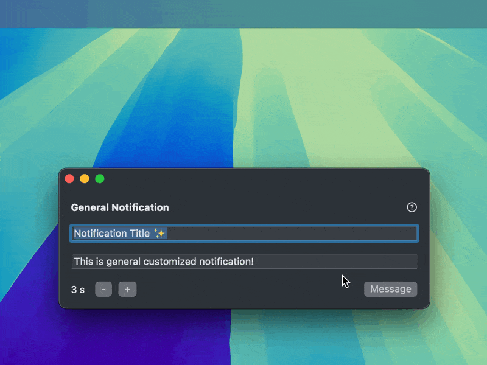

# GeneralNotification

GeneralNotification is a Swift package for displaying custom notifications on macOS. It is modified based on the [NotchNotification](https://github.com/Lakr233/NotchNotification) project.

## Features

- Support for custom notification content
- Simple and easy-to-use API

## Preview



## Installation

Add the following dependency to your `Package.swift` file:

```swift
dependencies: [
    .package(url: "https://github.com/okooo5km/GeneralNotification.git", from: "1.0.0"),
]
```

## Usage

GeneralNotification provides a simple API for displaying custom notifications:

```swift
import GeneralNotification
import SwiftUI

GeneralNotification.present(
    bodyView: HStack {
        Image(nsImage: NSApplication.shared.applicationIconImage)
            .resizable()
            .aspectRatio(contentMode: .fit)
            .frame(width: 48, height: 48)
        
        VStack(alignment: .leading) {
            Text(title)
                .font(.headline)
            Text(message)
                .font(.caption)
        }
        
        Image(systemName: "bell.fill")
            .font(.system(size: 16))
            .padding(8)
    },
    interval: interval
)
```

Parameters:

- `bodyView`: The content view of the notification, built using SwiftUI
- `interval`: The duration (in seconds) for which the notification is displayed, default is 2 seconds

## Example Project

An example project is provided in the `Example` directory, demonstrating how to use GeneralNotification in a real application.

## Requirements

- macOS 12.0+
- Swift 5.7+

## Contributing

Issues and pull requests are welcome to help improve this project.

## License

This project is a derivative work based on [NotchNotification](https://github.com/Lakr233/NotchNotification), which is licensed under the MIT License. The original copyright notice is retained in the source files.

The modifications and additional work in this project are also licensed under the MIT License. See the [LICENSE](LICENSE) file for the full license text.

By using, distributing, or contributing to this project, you agree to the terms and conditions of the MIT License for both the original work and the modifications.

## Acknowledgements

This project is developed based on [NotchNotification](https://github.com/Lakr233/NotchNotification). We are grateful to the original author, Lakr Aream, for their contribution and for making their work available under an open-source license.

---

© 2024 okooo5km. All Rights Reserved.
